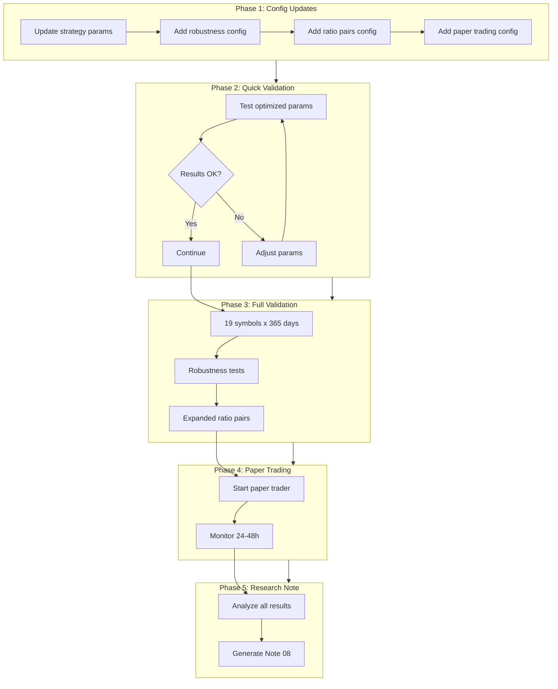

# Complete Validation Pipeline

Execute all 5 steps with config-first approach: optimized parameters, full validation, robustness testing, paper trading, and ratio pair expansion.

## 1. Update Configs with Optimized Parameters

### 1.1 Update [config/creative_testing.yaml](config/creative_testing.yaml)

Replace current strategy defaults with Phase 2 optimized params:

```yaml
# In strategy_configs section
eth_btc_ratio_reversion:
  type: eth_btc_ratio_reversion
  params:
    lookback: 168              # was 168, confirmed optimal
    entry_threshold: -1.5      # was -2.0, CHANGED (more sensitive)
    exit_threshold: -0.7       # was -0.5, CHANGED (wait longer)
    max_hold_hours: 72         # confirmed optimal

eth_btc_ratio_confirmed:
  type: eth_btc_ratio_confirmed
  params:
    lookback: 120              # was 168, CHANGED (faster)
    entry_threshold: -1.5      # was -2.0, CHANGED
    exit_threshold: -0.7       # was -0.5, CHANGED
    max_hold_hours: 72         # confirmed
    confirmation_delay: 2      # was 3, CHANGED (faster entry)
```


### 1.2 Add Robustness Testing Config

```yaml
# Add to creative_testing.yaml
robustness_testing:
  enabled: true
  
  cost_sensitivity:
    commission_rates: [0.0005, 0.001, 0.0015]
    slippage_rates: [0.0003, 0.0005, 0.001]
  
  time_periods:
        - name: "2023_H2"
      start: "2023-07-01"
      end: "2023-12-31"
        - name: "2024_H1"
      start: "2024-01-01"
      end: "2024-06-30"
        - name: "2024_H2"
      start: "2024-07-01"
      end: "2024-12-21"
  
  holdout_symbols:
        - AVAXUSDT
        - LINKUSDT
        - UNIUSDT
```


### 1.3 Add Expanded Ratio Pairs Config

```yaml
# New ratio strategies to test
expanded_ratio_strategies:
    - sol_btc_ratio_reversion
    - bnb_btc_ratio_reversion
    - link_btc_ratio_reversion
```


### 1.4 Add Paper Trading Config

Create [config/paper_trading.yaml](config/paper_trading.yaml):

```yaml
paper_trading:
  enabled: true
  exchange: binance_testnet
  
  strategies:
    eth_btc_ratio_optimized:
      type: eth_btc_ratio_reversion
      params:
        lookback: 168
        entry_threshold: -1.5
        exit_threshold: -0.7
        max_hold_hours: 72
      symbol: ETHUSDT
      interval: 1h
  
  risk_limits:
    max_position_pct: 0.25
    max_drawdown_pct: 0.15
    daily_loss_limit_pct: 0.05
  
  initial_capital: 10000
  
  logging:
    level: INFO
    file: notes/test_logs/paper_trading.log
```


## 2. Create Validation Script

### 2.1 Create [scripts/run_full_validation.py](scripts/run_full_validation.py)

All-in-one script that:

1. Quick validation (3 symbols) to verify optimized params
2. Full deep validation (19 symbols, 365 days)
3. Robustness testing (cost/time/holdout)
4. Compare all results

## 3. Implement Additional Ratio Strategies

### 3.1 Update [src/crypto/strategies/cross_symbol.py](src/crypto/strategies/cross_symbol.py)

Add generic `RatioReversionStrategy` that works for any pair:

```python
@strategy_registry.register("ratio_reversion")
class RatioReversionStrategy(CrossSymbolBaseStrategy):
    """Generic X/BTC ratio reversion strategy."""
    
    def _setup(self, reference_symbol="BTCUSDT", lookback=168, 
               entry_threshold=-1.5, exit_threshold=-0.7, max_hold_hours=72):
        self.reference_symbol = reference_symbol
        # ... same logic as ETH/BTC but configurable
```


## 4. Implement Paper Trading Runner

### 4.1 Create [scripts/run_paper_trading.py](scripts/run_paper_trading.py)

Script to:

- Load config from paper_trading.yaml
- Start LiveTrader with cross-symbol strategy support
- Log all trades and signals
- Track performance metrics in real-time

### 4.2 Update [src/crypto/trading/live.py](src/crypto/trading/live.py)

Add support for cross-symbol strategies (reference data loading):

```python
async def _load_reference_data(self):
    """Load reference data for cross-symbol strategies."""
    if isinstance(self.strategy, CrossSymbolBaseStrategy):
        for ref_symbol in self.strategy.get_reference_symbols():
            candles = await self.repository.get_candles_df(...)
            self.strategy.set_reference_data(ref_symbol, candles)
```


## 5. Execution Pipeline




## 6. Research Note Generation

### 6.1 Create [notes/research_notes/08-complete-validation-results.md](notes/research_notes/08-complete-validation-results.md)

Auto-generated note including:

- Optimized parameters comparison (before/after)
- Full validation results (19 symbols)
- Robustness test results (cost sensitivity, time periods)
- Expanded ratio pairs performance
- Paper trading initial results
- Final recommendations

## Files to Create/Modify

| File | Action | Description |

|------|--------|-------------|

| `config/creative_testing.yaml` | Modify | Update params, add robustness config |

| `config/paper_trading.yaml` | Create | Paper trading configuration |

| `scripts/run_full_validation.py` | Create | Complete validation runner |

| `scripts/run_paper_trading.py` | Create | Paper trading launcher |

| `src/crypto/strategies/cross_symbol.py` | Modify | Add generic RatioReversionStrategy |

| `src/crypto/trading/live.py` | Modify | Add cross-symbol support |

| `notes/research_notes/08-complete-validation-results.md` | Create | Final research note |

## Execution Order

1. Update all configs (10 min)
2. Run quick validation with optimized params (5 min)
3. Run full validation in background (60-90 min)
4. While waiting: implement paper trading updates (20 min)
5. Start paper trading (runs indefinitely)