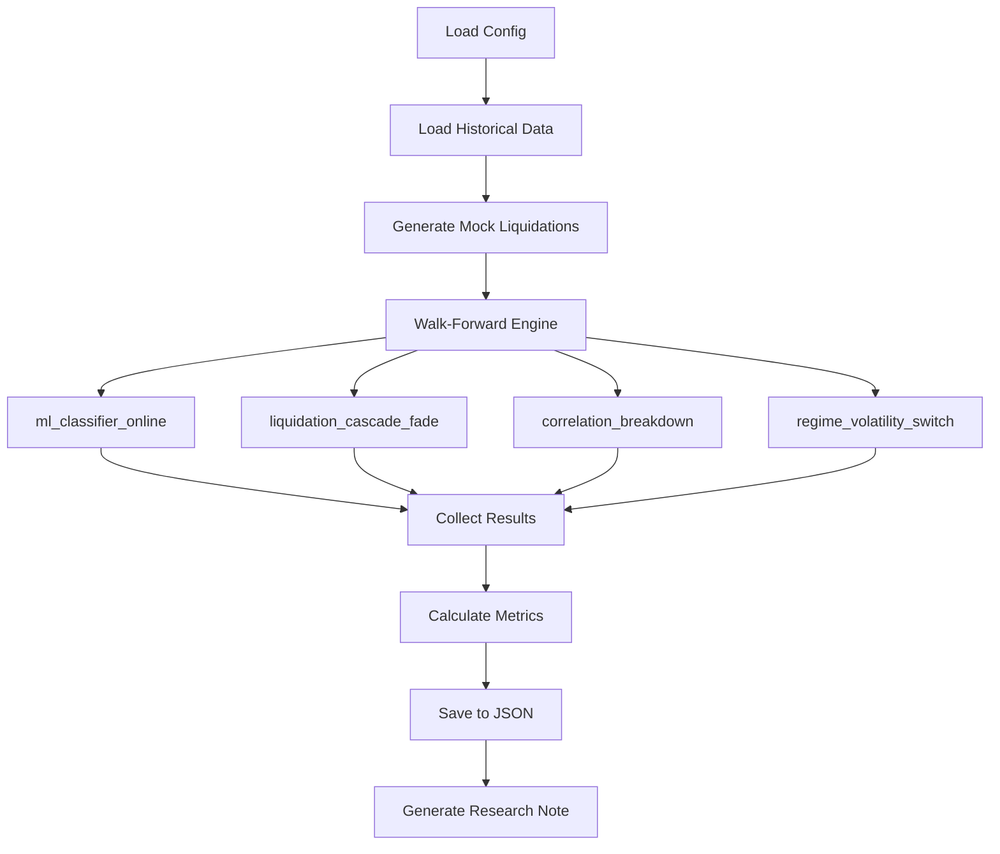

# Creative Diversification Strategies Implementation

## Context

Current portfolio: 4 ratio strategies + 1 diversifier (basis_proxy). Need strategies that are active when ratio strategies are quiet (trending markets, sector rotations, volatility regimes).

## Strategy Overview

| Strategy | Class | File | Key Differentiator |
|----------|-------|------|-------------------|
| Online ML Adaptive | `MLClassifierOnlineStrategy` | `ml_online.py` | Rolling retraining adapts to regime changes |
| Liquidation Cascade Fade | `LiquidationCascadeFadeStrategy` | `alternative_data_strategies.py` | Trades leverage flushes (mock data) |
| Correlation Breakdown | `CorrelationBreakdownStrategy` | `cross_symbol.py` | Alt vs Alt relative strength |
| Regime Volatility Switch | `RegimeVolatilitySwitchStrategy` | `volatility_trading.py` | Momentum in trends, reversion in ranges |

## Phase 1: Configuration (Config-First)

### 1.1 Add strategy instances to `config/strategies.yaml`

```yaml
# New diversification strategies - Note 12
ml_classifier_online_v1:
  type: ml_classifier_online
  params:
    features: [volume_momentum, adx, rsi_14]
    train_window: 2160  # 90 days
    retrain_every: 168  # Weekly retraining
    prediction_horizon: 10
    buy_threshold: 0.55
    sell_threshold: 0.45
    decay_factor: 0.99

liquidation_cascade_fade_v1:
  type: liquidation_cascade_fade
  params:
    liquidation_threshold: 5000000  # $5M threshold
    lookback_hours: 1
    fade_delay: 2
    hold_period: 24

correlation_breakdown_sol_avax:
  type: correlation_breakdown
  params:
    reference_symbol: AVAXUSDT
    correlation_window: 720
    min_correlation: 0.80
    divergence_threshold: 0.025
    max_hold_hours: 48

regime_volatility_switch_v1:
  type: regime_volatility_switch
  params:
    atr_period: 14
    regime_window: 168
    high_vol_threshold: 65
    low_vol_threshold: 35
    rsi_oversold: 25
    rsi_overbought: 75
    momentum_threshold: 0.025
    hold_period: 36
```

### 1.2 Add testing config to `config/creative_testing.yaml`

Add new section `diversification_strategies` with walk-forward settings:
- Symbols: BTCUSDT, ETHUSDT, SOLUSDT, AVAXUSDT, LINKUSDT
- Train window: 720h (30 days)
- Test window: 168h (7 days)
- Period: 365 days

## Phase 2: Mock Liquidation Data Generator

Create `src/crypto/data/mock_liquidations.py`:

```python
def generate_mock_liquidations(candles: pd.DataFrame) -> pd.DataFrame:
    """
    Generate simulated liquidation events based on:
    - Price volatility spikes (ATR > 95th percentile)
    - Large price drops (>3% in 1h) -> long liquidations
    - Large price spikes (>3% in 1h) -> short liquidations
    """
```

This allows backtesting without real CoinGlass data.

## Phase 3: Backtest Script

Create `scripts/run_diversification_testing.py`:



Key metrics to capture:
- OOS Sharpe ratio
- Win rate vs Buy-and-Hold
- Trade frequency
- Max drawdown
- Correlation with existing ratio strategies

## Phase 4: Research Note

Create `notes/research_notes/12-diversification-strategies.md`:

Structure:
1. Executive Summary
2. Methodology
3. Results by Strategy
4. Correlation Analysis (vs existing ratio strategies)
5. Portfolio Impact Assessment
6. Recommendations

## File Changes Summary

| File | Action |
|------|--------|
| `config/strategies.yaml` | Add 4 new strategy configs |
| `config/creative_testing.yaml` | Add diversification testing section |
| `src/crypto/data/mock_liquidations.py` | Create mock liquidation generator |
| `scripts/run_diversification_testing.py` | Create backtest script |
| `notes/research_notes/12-diversification-strategies.md` | Create with results |

## Success Criteria

- At least 1 strategy with OOS Sharpe > 0.5
- At least 1 strategy with correlation < 0.3 to ratio strategies
- Trade frequency between 2-15 trades/month
- Max drawdown < 25%
