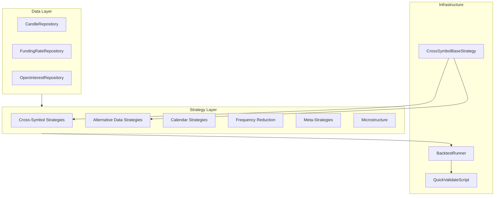

# Creative Strategy Testing Suite Implementation

## Overview

Implement 21 creative trading strategies across 6 categories, with alternative data ingestion (funding rates, open interest), cross-symbol signal infrastructure, and comprehensive testing framework. All strategies target hourly data with reduced trading frequency.

## Architecture



## Phase 1: Configuration (Config-First)

### 1.1 Add new strategies to [config/strategies.yaml](config/strategies.yaml)

Add all 21 strategy configurations under new sections:
- Cross-symbol strategies (5)
- Alternative data strategies (4)
- Calendar strategies (3)
- Frequency reduction strategies (3)
- Meta-strategies (3)
- Microstructure strategies (3)

Key config pattern for cross-symbol strategies:
```yaml
btc_lead_alt_follow:
  type: btc_lead_alt_follow
  params:
    leader_symbol: BTCUSDT
    breakout_period: 24
    entry_delay: 1
    hold_period: 48
  symbols: [SOLUSDT, AVAXUSDT, NEARUSDT]
  interval: 1h
  stop_loss_pct: 0.04
  take_profit_pct: 0.12
  enabled: true
```

### 1.2 Update [config/optimization.yaml](config/optimization.yaml)

Add creative testing section with validation gates that require:
- OOS Sharpe > 0.5
- Beat buy-and-hold
- Trades per month < 20

## Phase 2: Data Infrastructure

### 2.1 Database Models

Create new models in [src/crypto/data/models.py](src/crypto/data/models.py):
- `FundingRateModel` - stores 8h funding rate snapshots
- `OpenInterestModel` - stores hourly open interest

### 2.2 Database Migration

Create Alembic migration in `alembic/versions/`:
- Add `funding_rates` table (symbol, timestamp, rate)
- Add `open_interest` table (symbol, timestamp, value)
- Add hypertable conversion for TimescaleDB

### 2.3 Repositories

Create [src/crypto/data/alternative_data.py](src/crypto/data/alternative_data.py):
- `FundingRateRepository` - query funding rates aligned to candle timestamps
- `OpenInterestRepository` - query OI aligned to candle timestamps

### 2.4 Ingestion Service

Extend [src/crypto/data/ingestion.py](src/crypto/data/ingestion.py):
- Add `ingest_funding_rates()` method - fetches from Binance Futures API
- Add `ingest_open_interest()` method - fetches from Binance Futures API

### 2.5 Ingestion Script

Create [scripts/ingest_alternative_data.py](scripts/ingest_alternative_data.py):
- CLI for ingesting funding rates and OI history
- Support for multiple symbols and date ranges

## Phase 3: Strategy Infrastructure

### 3.1 Cross-Symbol Base Class

Create [src/crypto/strategies/cross_symbol_base.py](src/crypto/strategies/cross_symbol_base.py):
```python
class CrossSymbolBaseStrategy(BaseStrategy):
    """Base for strategies that use signals from other symbols."""
    
    reference_symbols: list[str]
    reference_data: dict[str, pd.DataFrame]
    
    def set_reference_data(self, symbol: str, candles: pd.DataFrame):
        """Provide data from reference symbol."""
        
    def get_reference_candles(self, symbol: str, up_to: pd.Timestamp):
        """Get reference data up to timestamp (no lookahead)."""
```

### 3.2 Update BacktestRunner

Modify [src/crypto/backtesting/runner.py](src/crypto/backtesting/runner.py):
- Add `load_reference_data()` to pre-load BTC/ETH data for cross-symbol strategies
- Pass reference data to strategies before generating signals

## Phase 4: Strategy Implementation

### 4.1 Category A: Cross-Symbol Strategies

Create [src/crypto/strategies/cross_symbol.py](src/crypto/strategies/cross_symbol.py):

| Strategy | Key Logic |
|----------|-----------|
| `BTCLeadAltFollowStrategy` | BTC breakout -> buy alt next bar, hold 48h |
| `ETHBTCRatioReversionStrategy` | ETH/BTC z-score < -2 -> long ETH |
| `CorrelationBreakdownStrategy` | High corr + divergence -> trade laggard |
| `SectorMomentumRotationStrategy` | Weekly rebalance to top sector |
| `BTCVolatilityFilterStrategy` | Meta-filter: no trades when BTC ATR high |

### 4.2 Category B: Alternative Data Strategies

Create [src/crypto/strategies/alternative_data.py](src/crypto/strategies/alternative_data.py):

| Strategy | Key Logic |
|----------|-----------|
| `FundingRateFadeStrategy` | Extreme funding -> avoid/fade direction |
| `FundingRateCarryStrategy` | Positive funding avg -> long spot |
| `OpenInterestDivergenceStrategy` | Price up + OI down -> weak rally |
| `LiquidationCascadeFadeStrategy` | Post-liquidation mean reversion |

### 4.3 Category C: Calendar Strategies

Create [src/crypto/strategies/calendar.py](src/crypto/strategies/calendar.py):

| Strategy | Key Logic |
|----------|-----------|
| `WeekendEffectStrategy` | Exit Friday, re-enter Monday |
| `HourOfDayFilterStrategy` | Only trade 14:00-22:00 UTC |
| `MonthEndRebalancingStrategy` | Trade last 3 days of month |

### 4.4 Category D: Frequency Reduction Strategies

Create [src/crypto/strategies/frequency.py](src/crypto/strategies/frequency.py):

| Strategy | Key Logic |
|----------|-----------|
| `WeeklyMomentumStrategy` | Weekly rebalance, hold winners |
| `SignalConfirmationDelayStrategy` | Require 4h confirmation |
| `SignalStrengthFilterStrategy` | Only trade RSI < 20 (not < 30) |

### 4.5 Category E: Meta-Strategies

Create [src/crypto/strategies/meta.py](src/crypto/strategies/meta.py):

| Strategy | Key Logic |
|----------|-----------|
| `RegimeGateStrategy` | Only trade clear regimes (ADX > 30 or < 15) |
| `DrawdownPauseStrategy` | Pause 48h after 5% drawdown |
| `StrategyMomentumStrategy` | Use recently winning strategy |

### 4.6 Category F: Microstructure Strategies

Create [src/crypto/strategies/microstructure.py](src/crypto/strategies/microstructure.py):

| Strategy | Key Logic |
|----------|-----------|
| `VolumeBreakoutConfirmationStrategy` | Breakout + volume > 2x avg |
| `VolumeDivergenceStrategy` | Price high + volume declining |
| `BuySellImbalanceStrategy` | Extreme buy/sell volume ratio |

## Phase 5: Testing Framework

### 5.1 Update Quick Validate Script

Modify [scripts/quick_validate.py](scripts/quick_validate.py):
- Add buy-and-hold comparison for each symbol
- Add trades-per-month metric
- Support loading reference data for cross-symbol strategies

### 5.2 Create Creative Testing Script

Create [scripts/run_creative_testing.py](scripts/run_creative_testing.py):
- Phase 1: Quick validation (3 symbols, 6 months)
- Phase 2: Deep validation (19 symbols, 12 months)
- Phase 3: Robustness testing (cost sensitivity, time periods)
- Output results to `notes/creative_testing_results/`

### 5.3 Update Strategy Imports

Update [src/crypto/strategies/__init__.py](src/crypto/strategies/__init__.py):
- Import all new strategy modules so registry picks them up

## File Summary

| File | Action | Description |
|------|--------|-------------|
| `config/strategies.yaml` | Modify | Add 21 new strategy configs |
| `config/optimization.yaml` | Modify | Add creative testing section |
| `src/crypto/data/models.py` | Modify | Add FundingRate, OpenInterest models |
| `src/crypto/data/alternative_data.py` | Create | New repositories for alt data |
| `src/crypto/data/ingestion.py` | Modify | Add funding/OI ingestion |
| `alembic/versions/20241221_0002_*.py` | Create | Migration for new tables |
| `src/crypto/strategies/cross_symbol_base.py` | Create | Base class for cross-symbol |
| `src/crypto/strategies/cross_symbol.py` | Create | 5 cross-symbol strategies |
| `src/crypto/strategies/alternative_data.py` | Create | 4 alt data strategies |
| `src/crypto/strategies/calendar.py` | Create | 3 calendar strategies |
| `src/crypto/strategies/frequency.py` | Create | 3 frequency reduction strategies |
| `src/crypto/strategies/meta.py` | Create | 3 meta-strategies |
| `src/crypto/strategies/microstructure.py` | Create | 3 microstructure strategies |
| `src/crypto/strategies/__init__.py` | Modify | Import new modules |
| `src/crypto/backtesting/runner.py` | Modify | Support reference data |
| `scripts/ingest_alternative_data.py` | Create | Ingest funding/OI data |
| `scripts/run_creative_testing.py` | Create | Run all testing phases |
| `scripts/quick_validate.py` | Modify | Add B&H comparison |

## Implementation Order

1. **Config first**: Update `strategies.yaml` and `optimization.yaml`
2. **Data layer**: Models, migration, repositories, ingestion
3. **Infrastructure**: Cross-symbol base class, BacktestRunner updates
4. **Strategies**: Implement in priority order (A, D, F first - no new data needed)
5. **Testing**: Update scripts, run validation