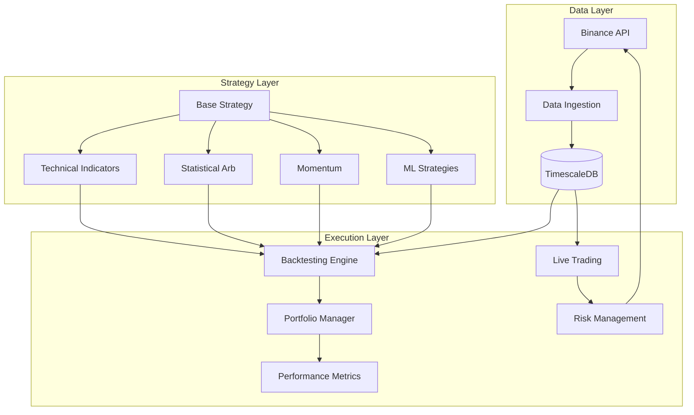

# Crypto Trading Platform Architecture

## Architecture Overview




## Project Structure

```javascript
src/crypto/
├── config.py                 # Settings via pydantic-settings
├── data/
│   ├── models.py             # SQLAlchemy + TimescaleDB hypertables
│   ├── database.py           # Async DB connection pool
│   ├── ingestion.py          # Binance historical/live data fetcher
│   └── repository.py         # Data access patterns
├── strategies/
│   ├── base.py               # Abstract Strategy protocol
│   ├── signals.py            # Signal enum (BUY/SELL/HOLD)
│   ├── technical.py          # SMA, EMA, RSI, MACD, Bollinger
│   ├── statistical.py        # Mean reversion, pairs trading
│   ├── momentum.py           # Trend following, breakout
│   └── ml.py                 # Sklearn-based predictive models
├── backtesting/
│   ├── engine.py             # Event-driven backtester
│   ├── portfolio.py          # Position & cash tracking
│   └── metrics.py            # Sharpe, Sortino, max drawdown, etc.
├── trading/
│   ├── executor.py           # Order execution abstraction
│   ├── risk.py               # Position sizing, stop-loss
│   └── live.py               # Live trading loop with websockets
└── cli.py                    # CLI commands (ingest, backtest, trade)
```


## Key Components

### 1. Data Layer - TimescaleDB Schema

Create hypertables optimized for time-series queries in [`src/crypto/data/models.py`](src/crypto/data/models.py):

```python
# OHLCV candle model - will become a TimescaleDB hypertable
class Candle(Base):
    __tablename__ = "candles"
    
    symbol: Mapped[str]           # e.g., "BTCUSDT"
    interval: Mapped[str]         # e.g., "1m", "1h", "1d"
    open_time: Mapped[datetime]   # Primary time dimension
    open: Mapped[Decimal]
    high: Mapped[Decimal]
    low: Mapped[Decimal]
    close: Mapped[Decimal]
    volume: Mapped[Decimal]
    
    # Composite primary key: (symbol, interval, open_time)
```


### 2. Data Ingestion - Binance Client

In [`src/crypto/data/ingestion.py`](src/crypto/data/ingestion.py):

- Fetch historical klines via REST API

- Stream live candles via WebSocket
- Rate limiting and retry logic
- Batch insert into TimescaleDB

### 3. Strategy Framework

Abstract base in [`src/crypto/strategies/base.py`](src/crypto/strategies/base.py):

```python
class Strategy(Protocol):
    name: str
    
    def generate_signals(self, candles: pd.DataFrame) -> pd.Series:
        """Return Series of Signal enum (BUY/SELL/HOLD) indexed by time."""
        ...
    
    def get_parameters(self) -> dict[str, Any]:
        """Return strategy parameters for logging/optimization."""
        ...
```


### 4. Backtesting Engine

Event-driven design in [`src/crypto/backtesting/engine.py`](src/crypto/backtesting/engine.py):

```python
class BacktestEngine:
    def run(
        self,
        strategy: Strategy,
        symbol: str,
        start: datetime,
        end: datetime,
        initial_capital: Decimal = Decimal("10000"),
        commission: Decimal = Decimal("0.001"),  # 0.1% Binance fee
    ) -> BacktestResult:
        ...
```


### 5. Performance Metrics

In [`src/crypto/backtesting/metrics.py`](src/crypto/backtesting/metrics.py):

- Total return, CAGR
- Sharpe ratio, Sortino ratio

- Maximum drawdown, drawdown duration
- Win rate, profit factor

- Trade statistics (avg win/loss, etc.)

### 6. Live Trading

In [`src/crypto/trading/live.py`](src/crypto/trading/live.py):

- WebSocket connection for real-time data

- Strategy signal generation
- Risk checks before order execution

- Order placement via Binance API
- Position and PnL tracking

## Dependencies

Add to [`pyproject.toml`](pyproject.toml):

```toml
dependencies = [
    "python-binance>=1.0.19",    # Binance API
    "sqlalchemy>=2.0",            # ORM
    "asyncpg>=0.29",              # Async PostgreSQL driver
    "alembic>=1.13",              # DB migrations
    "pandas>=2.0",                # Data manipulation
    "numpy>=1.26",                # Numerical operations
    "pandas-ta>=0.3",             # Technical indicators
    "scikit-learn>=1.4",          # ML strategies
    "pydantic-settings>=2.0",     # Configuration
    "typer>=0.9",                 # CLI
    "rich>=13.0",                 # Pretty output
]
```


## Database Setup

TimescaleDB setup script (Docker recommended):

```bash
docker run -d --name timescaledb \
  -p 5432:5432 \
  -e POSTGRES_PASSWORD=crypto \
  timescale/timescaledb:latest-pg16
```


## CLI Interface

```bash
# Ingest historical data
python -m crypto ingest --symbol BTCUSDT --interval 1h --start 2023-01-01

# Run backtest
python -m crypto backtest --strategy sma_crossover --symbol BTCUSDT --start 2023-01-01 --end 2024-01-01

# Start live trading (paper mode first)
python -m crypto trade --strategy sma_crossover --symbol BTCUSDT --paper

# Start real trading
python -m crypto trade --strategy sma_crossover --symbol BTCUSDT

```