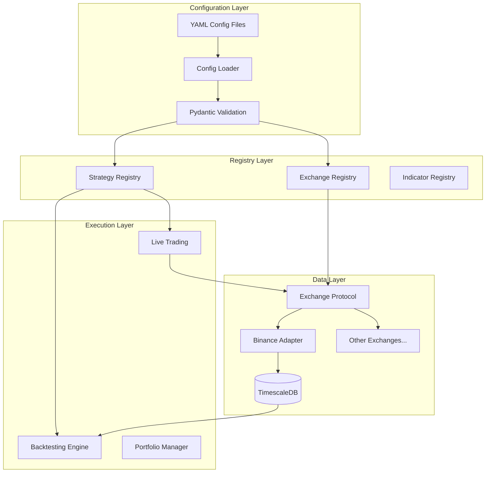

# Config-First Extensible Crypto Trading Platform

## Core Principles

1. **Config-First**: All strategies, parameters, backtests, and trading setups defined in YAML files - no hardcoded values
2. **Extensible**: Registry/plugin pattern for strategies and exchanges - add new ones without touching core code
3. **Convention over Configuration**: Sensible defaults, override only what you need

## Revised Architecture




## Project Structure

```javascript
crypto/
├── config/                          # YAML configuration files
│   ├── settings.yaml                # Global settings (DB, logging, etc.)
│   ├── exchanges.yaml               # Exchange credentials and settings
│   ├── strategies.yaml              # Strategy definitions with parameters
│   └── backtests.yaml               # Backtest run configurations
├── src/crypto/
│   ├── config/
│   │   ├── loader.py                # YAML loader with environment variable support
│   │   ├── schemas.py               # Pydantic models for all config types
│   │   └── settings.py              # Settings singleton
│   ├── core/
│   │   ├── registry.py              # Generic registry base class
│   │   ├── plugin.py                # Plugin discovery and loading
│   │   └── types.py                 # Common types (Signal, OrderSide, etc.)
│   ├── exchanges/
│   │   ├── base.py                  # Exchange protocol/interface
│   │   ├── registry.py              # Exchange registry
│   │   └── binance.py               # Binance implementation
│   ├── indicators/
│   │   ├── base.py                  # Indicator protocol
│   │   ├── registry.py              # Indicator registry
│   │   └── technical.py             # SMA, EMA, RSI, MACD, etc.
│   ├── strategies/
│   │   ├── base.py                  # Strategy protocol
│   │   ├── registry.py              # Strategy registry with auto-discovery
│   │   ├── technical.py             # Technical indicator strategies
│   │   ├── statistical.py           # Mean reversion strategies
│   │   ├── momentum.py              # Trend following strategies
│   │   └── ml.py                    # ML-based strategies
│   ├── data/
│   │   ├── models.py                # SQLAlchemy models
│   │   ├── database.py              # Async DB connection
│   │   ├── repository.py            # Data access layer
│   │   └── ingestion.py             # Data fetching service
│   ├── backtesting/
│   │   ├── engine.py                # Config-driven backtester
│   │   ├── portfolio.py             # Position tracking
│   │   ├── metrics.py               # Performance metrics
│   │   └── runner.py                # Batch backtest runner from config
│   ├── trading/
│   │   ├── executor.py              # Order execution
│   │   ├── risk.py                  # Risk management
│   │   └── live.py                  # Live trading loop
│   └── cli.py                       # CLI interface
└── plugins/                         # User-defined plugins (optional)
    └── strategies/                  # Custom strategies
```


## Configuration Files

### 1. `config/settings.yaml` - Global Settings

```yaml
database:
  host: ${DB_HOST:localhost}
  port: ${DB_PORT:5432}
  name: crypto
  user: ${DB_USER:postgres}
  password: ${DB_PASSWORD:crypto}

logging:
  level: INFO
  format: "%(asctime)s - %(name)s - %(levelname)s - %(message)s"

trading:
  default_commission: 0.001
  default_slippage: 0.0005
```


### 2. `config/exchanges.yaml` - Exchange Definitions

```yaml
exchanges:
  binance:
    adapter: binance
    testnet: true
    api_key: ${BINANCE_API_KEY}
    api_secret: ${BINANCE_API_SECRET}
    rate_limit: 1200  # requests per minute
    
  binance_prod:
    adapter: binance
    testnet: false
    api_key: ${BINANCE_PROD_API_KEY}
    api_secret: ${BINANCE_PROD_API_SECRET}
```


### 3. `config/strategies.yaml` - Strategy Definitions

```yaml
strategies:
  sma_crossover_btc:
    type: sma_crossover          # Maps to registered strategy class
    params:
      fast_period: 10
      slow_period: 30
    symbols: [BTCUSDT]
    interval: 1h

  rsi_mean_reversion:
    type: rsi_mean_reversion
    params:
      period: 14
      oversold: 30
      overbought: 70
    symbols: [ETHUSDT, BTCUSDT]
    interval: 4h

  ml_gradient_boost:
    type: ml_classifier
    params:
      model: gradient_boosting
      features: [sma_20, rsi_14, macd]
      lookback: 100
      train_size: 0.8
    symbols: [BTCUSDT]
    interval: 1d
```


### 4. `config/backtests.yaml` - Backtest Configurations

```yaml
backtests:
  btc_strategies_2024:
    name: "BTC Strategy Comparison 2024"
    strategies:
    - sma_crossover_btc
    - rsi_mean_reversion
    symbol: BTCUSDT
    start: "2024-01-01"
    end: "2024-12-01"
    initial_capital: 10000
    commission: 0.001

  multi_asset_momentum:
    name: "Multi-Asset Momentum Test"
    strategies:
    - momentum_breakout
    symbols: [BTCUSDT, ETHUSDT, SOLUSDT]
    start: "2023-06-01"
    end: "2024-06-01"
    initial_capital: 50000
```


## Key Components

### 1. Generic Registry Pattern

```python
# src/crypto/core/registry.py
class Registry(Generic[T]):
    """Auto-discovery registry for plugins."""
    
    _items: dict[str, type[T]]
    
    @classmethod
    def register(cls, name: str) -> Callable:
        """Decorator to register a class."""
        def decorator(klass: type[T]) -> type[T]:
            cls._items[name] = klass
            return klass
        return decorator
    
    @classmethod
    def get(cls, name: str) -> type[T]:
        """Get registered class by name."""
        ...
    
    @classmethod
    def create(cls, name: str, **params) -> T:
        """Instantiate a registered class with params."""
        ...
```


### 2. Strategy Registration

```python
# src/crypto/strategies/technical.py
from crypto.strategies.registry import strategy_registry

@strategy_registry.register("sma_crossover")
class SMACrossoverStrategy(Strategy):
    """SMA Crossover strategy - loaded from config."""
    
    def __init__(self, fast_period: int = 10, slow_period: int = 30):
        self.fast_period = fast_period
        self.slow_period = slow_period
    
    def generate_signals(self, candles: pd.DataFrame) -> pd.Series:
        ...
```


### 3. Exchange Protocol

```python
# src/crypto/exchanges/base.py
class Exchange(Protocol):
    """Exchange interface - implement to add new exchanges."""
    
    name: str
    
    async def fetch_ohlcv(self, symbol: str, interval: str, 
                          start: datetime, end: datetime) -> list[Candle]: ...
    
    async def place_order(self, symbol: str, side: OrderSide, 
                          quantity: Decimal, order_type: OrderType) -> Order: ...
    
    async def get_balance(self, asset: str) -> Decimal: ...
    
    def subscribe_candles(self, symbol: str, interval: str, 
                          callback: Callable) -> None: ...
```


### 4. Config-Driven Backtest Runner

```python
# src/crypto/backtesting/runner.py
class BacktestRunner:
    """Run backtests from YAML configuration."""
    
    def run_from_config(self, backtest_name: str) -> list[BacktestResult]:
        config = load_backtest_config(backtest_name)
        results = []
        
        for strategy_name in config.strategies:
            strategy = strategy_registry.create_from_config(strategy_name)
            result = self.engine.run(strategy, config)
            results.append(result)
        
        return results
```


## CLI Interface

```bash
# Ingest data using exchange from config
crypto ingest --exchange binance --symbol BTCUSDT --interval 1h --days 365

# Run a single backtest from config
crypto backtest run btc_strategies_2024

# Run all backtests
crypto backtest run-all

# Compare strategy results
crypto backtest compare btc_strategies_2024 --output report.html

# List available strategies
crypto strategies list

# Validate configuration files
crypto config validate

# Start paper trading
crypto trade --config paper_trading --strategy sma_crossover_btc

# Start live trading
crypto trade --config live_binance --strategy sma_crossover_btc
```


## Dependencies

```toml
dependencies = [
    "python-binance>=1.0.19",
    "sqlalchemy[asyncio]>=2.0",
    "asyncpg>=0.29",
    "alembic>=1.13",
    "pandas>=2.0",
    "numpy>=1.26",
    "pandas-ta>=0.3",
    "scikit-learn>=1.4",
    "pydantic>=2.0",
    "pydantic-settings>=2.0",
    "pyyaml>=6.0",
    "typer[all]>=0.9",
    "rich>=13.0",
    "httpx>=0.27",
    "websockets>=12.0",
]
```


## Extensibility Example

To add a new strategy, users just:

1. Create a Python file in `plugins/strategies/` or `src/crypto/strategies/`
2. Use the `@strategy_registry.register()` decorator
3. Add configuration in `config/strategies.yaml`
```python
# plugins/strategies/my_custom.py
from crypto.strategies.registry import strategy_registry
from crypto.strategies.base import Strategy

@strategy_registry.register("my_custom_strategy")
class MyCustomStrategy(Strategy):
    def __init__(self, threshold: float = 0.5):
        self.threshold = threshold
    
    def generate_signals(self, candles):
        # Custom logic here
        ...
```


```yaml
# config/strategies.yaml
strategies:
  my_custom:
    type: my_custom_strategy
    params:
      threshold: 0.7
    symbols: [BTCUSDT]
    interval: 1h


```