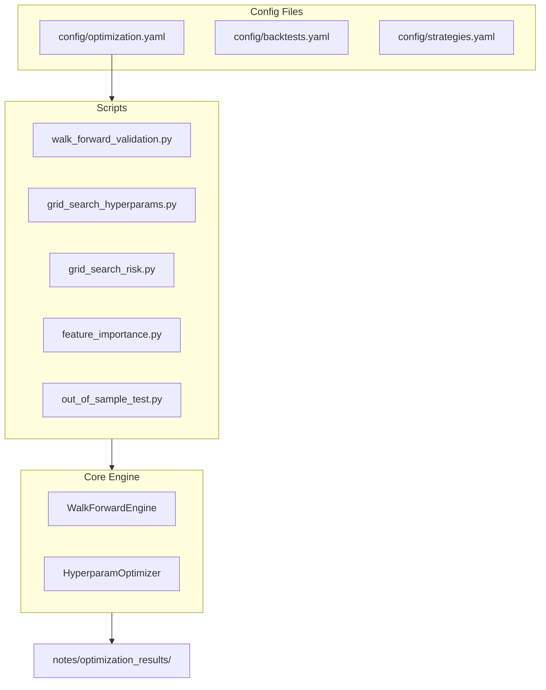

# ML Strategy Optimization Suite

## Architecture Overview



---

## 1. New Config File: `config/optimization.yaml`

Central configuration for all optimization tasks:

```yaml
optimization:
  # Walk-forward validation settings
  walk_forward:
    enabled: true
    train_window: 720        # 30 days of 1h candles
    test_window: 168         # 7 days of 1h candles
    step_size: 168           # Roll forward 7 days at a time
    min_train_samples: 500
    strategies:
            - ml_classifier_xgb
            - ml_classifier_hybrid
            - ml_ensemble_voting
    symbols: [APTUSDT, NEARUSDT, DOTUSDT, XLMUSDT, XRPUSDT]
    interval: 1h
    days: 180                # 6 months of data

  # Hyperparameter grid search
  hyperparameters:
    ml_classifier_xgb:
      n_estimators: [100, 150, 200, 300]
      max_depth: [4, 5, 6, 8]
      learning_rate: [0.01, 0.05, 0.1]
      buy_threshold: [0.52, 0.55, 0.58]
      sell_threshold: [0.42, 0.45, 0.48]
    ml_classifier_hybrid:
      xgb_weight: [0.5, 0.6, 0.7]
      rf_weight: [0.3, 0.4, 0.5]
      n_estimators: [100, 150, 200]

  # Risk parameter grid search
  risk_params:
    stop_loss_pct: [0.02, 0.03, 0.04, 0.05, 0.06]
    take_profit_pct: [0.06, 0.08, 0.10, 0.12, 0.15]
    strategies:
            - ml_classifier_xgb
            - ml_classifier_hybrid

  # Out-of-sample testing
  out_of_sample:
    test_period:
      start: "2024-10-01"
      end: "2024-12-21"
    holdout_symbols: [AVAXUSDT, LINKUSDT, UNIUSDT]
    strategies:
            - ml_classifier_xgb
            - ml_classifier_hybrid
            - ml_ensemble_voting

  # Feature importance analysis
  feature_analysis:
    strategies: [ml_classifier_xgb]
    top_n_features: 10
    use_shap: true
```

---

## 2. Walk-Forward Validation Engine

**File:** [src/crypto/backtesting/walk_forward.py](src/crypto/backtesting/walk_forward.py) (new)Key class structure:

```python
@dataclass
class WalkForwardConfig:
    train_window: int
    test_window: int
    step_size: int
    min_train_samples: int

class WalkForwardEngine:
    def run(self, strategy_name, candles, config) -> WalkForwardResult:
        # Split data into rolling train/test windows
        # Train on window, test on next period
        # Aggregate out-of-sample results
```

**Script:** [scripts/walk_forward_validation.py](scripts/walk_forward_validation.py) (new)

- Reads config from `optimization.yaml`
- Runs walk-forward on specified strategies
- Outputs comparison: in-sample vs out-of-sample Sharpe

---

## 3. Hyperparameter Optimization

**Script:** [scripts/grid_search_hyperparams.py](scripts/grid_search_hyperparams.py) (new)

- Reads hyperparam grid from `optimization.yaml`
- Uses Optuna or grid search
- Walk-forward validation for each param combo
- Outputs best params per strategy

---

## 4. Risk Parameter Grid Search

**Update:** [scripts/grid_search_risk.py](scripts/grid_search_risk.py)Changes:

- Read strategies from `optimization.yaml` instead of hardcoded
- Add `ml_classifier_xgb` and `ml_classifier_hybrid`
- Import `ml_siblings` strategies

---

## 5. Feature Importance Analysis

**Script:** [scripts/feature_importance.py](scripts/feature_importance.py) (new)

- Extract feature importances from trained XGBoost models
- Optionally use SHAP for interpretability
- Output ranked feature list + visualization

---

## 6. Out-of-Sample Testing

**Script:** [scripts/out_of_sample_test.py](scripts/out_of_sample_test.py) (new)

- Test on holdout symbols not used in development
- Test on recent time period (Oct-Dec 2024)
- Compare to in-sample results

---

## 7. Config Schema Updates

**File:** [src/crypto/config/schemas.py](src/crypto/config/schemas.py)Add dataclasses:

- `WalkForwardConfig`
- `HyperparamConfig`
- `OptimizationConfig`

**File:** [src/crypto/config/loader.py](src/crypto/config/loader.py)Add loader for `optimization.yaml`---

## 8. Updated Backtests Config

**File:** [config/backtests.yaml](config/backtests.yaml)Add new backtest definitions for winning strategies:

```yaml
ml_siblings_evaluation:
  name: "ML Siblings Walk-Forward Evaluation"
  strategies:
        - ml_classifier_xgb
        - ml_classifier_hybrid
        - ml_ensemble_voting
  symbols: [APTUSDT, NEARUSDT, DOTUSDT, XLMUSDT, XRPUSDT]
  interval: 1h
  start: "2024-06-01"
  end: "2024-12-21"
```

---

## Execution Order

1. Create `config/optimization.yaml` with all settings
2. Add config schemas and loader
3. Implement `WalkForwardEngine` 
4. Create `walk_forward_validation.py` script
5. Update `grid_search_risk.py` for new strategies
6. Create `grid_search_hyperparams.py`
7. Create `feature_importance.py`
8. Create `out_of_sample_test.py`
9. Update `backtests.yaml`
10. Run full optimization suite
11. Document findings in research note

---

## Expected Outputs

- `notes/optimization_results/walk_forward_results.json`
- `notes/optimization_results/hyperparam_search.json`
- `notes/optimization_results/risk_grid_search.json`
- `notes/optimization_results/feature_importance.json`