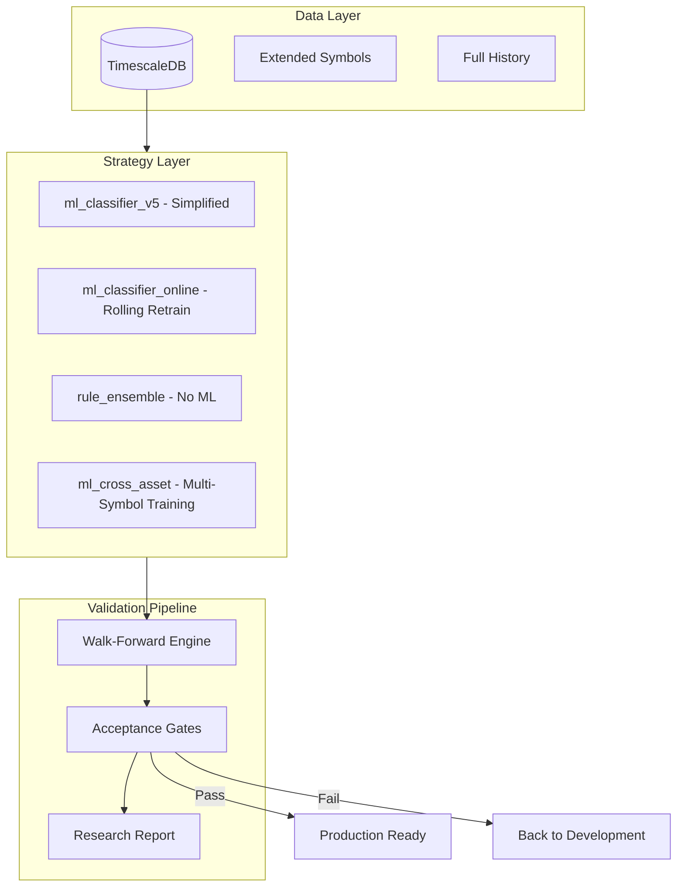

# ML Strategy Robustness Suite

## Problem Statement

Walk-forward validation revealed **severe overfitting**: all ML strategies showed 100%+ Sharpe degradation when tested out-of-sample in time. However, strategies generalize well to **new symbols** but NOT to **new time periods**.

This plan addresses temporal overfitting while leveraging the cross-asset generalization finding and your expanded dataset.

---

## Architecture Overview



---

## 1. New Simplified Strategy: `ml_classifier_v5`

Based on Note 03 recommendations: fewer features, stronger regularization, longer prediction horizon.**Key changes:**

- Only top 3 features: `volume_momentum`, `adx`, `rsi_14`
- Larger train window: 2160 bars (90 days)
- Longer prediction horizon: 10 bars
- Stronger regularization: `max_depth=3`, `min_samples_leaf=50`

- Fewer trees: `n_estimators=50`

**Files to modify:**

- [src/crypto/strategies/ml_siblings.py](src/crypto/strategies/ml_siblings.py) - Add `MLClassifierV5Strategy`

- [config/strategies.yaml](config/strategies.yaml) - Add `ml_classifier_v5` config

- [config/optimization.yaml](config/optimization.yaml) - Add to walk-forward strategies

---

## 2. Online Learning Strategy: `ml_classifier_online`

Retrain model on rolling window to adapt to temporal drift.**Key features:**

- Rolling train window (configurable, e.g., 90 days)
- Retrain every N bars (e.g., weekly = 168 bars for 1h)
- Use only recent data for prediction (no stale patterns)

- Exponential decay weighting for samples (recent data weighted higher)

**Files to create:**

- [src/crypto/strategies/ml_online.py](src/crypto/strategies/ml_online.py) - Online learning strategies

**Config addition:**

```yaml
ml_classifier_online:
  type: ml_classifier_online
  params:
    features: [volume_momentum, adx, rsi_14]
    train_window: 2160      # 90 days
    retrain_every: 168      # Weekly
    use_sample_weights: true
    decay_factor: 0.99
```

---

## 3. Rule-Based Ensemble: `rule_ensemble`

Simple, interpretable rules that cannot overfit to temporal patterns.**Components:**

- ADX trend confirmation (ADX > 25)

- RSI extremes (< 30 buy, > 70 sell)
- Volume spike detection (> 2x average)

- Moving average alignment (EMA12 > EMA26)
- Voting mechanism (3+ rules agree)

**Files to create:**

- [src/crypto/strategies/rule_ensemble.py](src/crypto/strategies/rule_ensemble.py)

**Why this works:** Rule-based strategies encode domain knowledge and don't learn from data, so they can't overfit.---

## 4. Cross-Asset Training Strategy: `ml_cross_asset`

Leverage the finding that cross-symbol generalization works.**Key idea:** Train on ALL symbols together, test on each individually.

**Benefits:**

- More training data
- Model learns general crypto patterns, not symbol-specific ones

- Regularization effect from diverse data

**Implementation:**

- Train on combined DataFrame from all symbols
- Add symbol embedding or leave as universal model
- Normalized features (already relative to price)

**Files to create:**

- [src/crypto/strategies/ml_cross_asset.py](src/crypto/strategies/ml_cross_asset.py)

---

## 5. Extended Configuration Updates

### 5.1 Update `config/optimization.yaml`

```yaml
optimization:
  walk_forward:
    enabled: true
    train_window: 2160      # 90 days (was 720/30 days)
    test_window: 336        # 14 days (was 168/7 days)
    step_size: 168          # Weekly
    min_train_samples: 1500
    
    strategies:
    - ml_classifier_v5
    - ml_classifier_online
    - rule_ensemble
    - ml_cross_asset
    
    symbols:
      # All available symbols from extended dataset
    - BTCUSDT
    - ETHUSDT
    - BNBUSDT
    - XRPUSDT
    - SOLUSDT
    - ADAUSDT
    - DOGEUSDT
    - AVAXUSDT
    - DOTUSDT
    - LINKUSDT
    - LTCUSDT
    - NEARUSDT
    - APTUSDT
    - ATOMUSDT
    - UNIUSDT
      # Add all new symbols here
    
    interval: 1h
    days: 365               # Full year (extended window)
    
    # NEW: Acceptance criteria
    acceptance:
      min_oos_sharpe: 0.5
      max_degradation: 40
      min_trades_per_fold: 5
```


### 5.2 Add Acceptance Gate Config

```yaml
  validation_gates:
    enabled: true
    criteria:
    - name: positive_oos_sharpe
        metric: oos_sharpe
        operator: gt
        threshold: 0
    - name: acceptable_degradation
        metric: sharpe_degradation
        operator: lt
        threshold: 50
    - name: sufficient_trades
        metric: oos_total_trades
        operator: gt
        threshold: 20
    
    # Fail-safe: reject if ALL folds show negative OOS
    reject_all_negative_folds: true
```

---

## 6. Validation Pipeline with Acceptance Gates

### 6.1 Update Walk-Forward Engine

Add acceptance gate logic to [src/crypto/backtesting/walk_forward.py](src/crypto/backtesting/walk_forward.py):

```python
@dataclass
class AcceptanceGate:
    metric: str
    operator: str  # 'gt', 'lt', 'eq'
    threshold: float

def check_acceptance(result: WalkForwardResult, gates: list[AcceptanceGate]) -> bool:
    """Check if result passes all acceptance gates."""
    ...
```


### 6.2 New Validation Script

Create [scripts/validate_strategies.py](scripts/validate_strategies.py):

- Runs walk-forward on all configured strategies
- Applies acceptance gates
- Generates pass/fail report

- Outputs `notes/validation_report.md`

---

## 7. Research Report Generator

Auto-generate research note from validation results.**File to create:** [scripts/generate_research_report.py](scripts/generate_research_report.py)

**Output:** `notes/04-robustness-validation.md`**Contents:**

- Summary table of all strategies
- Pass/fail status per strategy
- Comparison with previous results
- Recommendations
- Configuration used

---

## 8. Feature Engineering Improvements

Based on feature importance analysis (volume_momentum was #1):

### 8.1 Enhanced Volume Features

Add to [src/crypto/indicators/base.py](src/crypto/indicators/base.py):

- `volume_zscore`: Z-score of volume vs rolling mean
- `volume_breakout`: Binary flag for volume > 2x average

- `obv_trend`: OBV rate of change over multiple periods

### 8.2 Regime Features

- `volatility_regime`: Classify as low/medium/high based on ATR percentile

- `trend_regime`: Classify as trending/ranging based on ADX

---

## 9. Implementation Order

| Phase | Task | Priority |

|-------|------|----------|

| 1 | Update optimization.yaml with extended symbols/timeframe | High |

| 2 | Implement `ml_classifier_v5` (simplified) | High |

| 3 | Implement `rule_ensemble` (no ML baseline) | High |

| 4 | Add acceptance gates to walk-forward | High |

| 5 | Create validation pipeline script | High |

| 6 | Implement `ml_classifier_online` (rolling retrain) | Medium |

| 7 | Implement `ml_cross_asset` (multi-symbol training) | Medium |

| 8 | Add new volume/regime indicators | Medium |

| 9 | Create research report generator | Low |---

## 10. Success Criteria

A strategy is considered **production-ready** if:

1. OOS Sharpe > 0 (doesn't lose money forward in time)

2. Sharpe degradation < 40% (not severely overfit)
3. Passes validation on at least 80% of symbols

4. Total OOS trades > 20 (sufficient sample size)
5. Max drawdown < 25% (acceptable risk)

---

## Files Summary

**New files:**

- `src/crypto/strategies/ml_online.py` - Online learning strategy

- `src/crypto/strategies/rule_ensemble.py` - Rule-based ensemble
- `src/crypto/strategies/ml_cross_asset.py` - Cross-asset training

- `scripts/validate_strategies.py` - Validation pipeline
- `scripts/generate_research_report.py` - Report generator

**Modified files:**

- `src/crypto/strategies/ml_siblings.py` - Add `ml_classifier_v5`
- `src/crypto/backtesting/walk_forward.py` - Add acceptance gates

- `config/optimization.yaml` - Extended config with gates