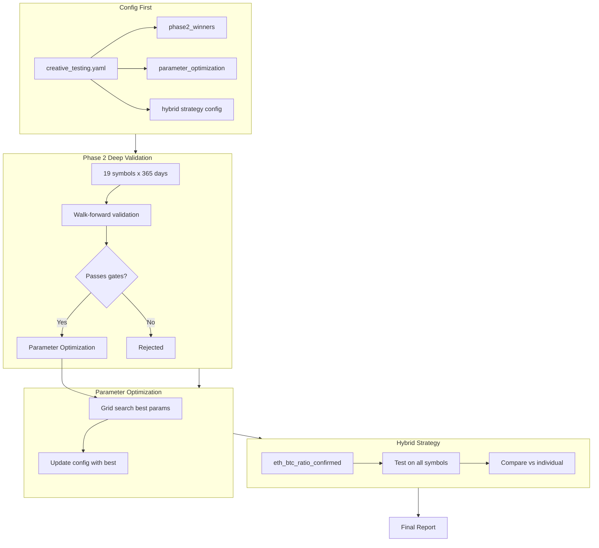

# Phase 2 Deep Validation & Optimization

Execute comprehensive validation of the 2 winning strategies from Phase 1, optimize their parameters, and create a combined hybrid strategy.

## 1. Config Updates (config-first)

### 1.1 Update [config/creative_testing.yaml](config/creative_testing.yaml)

Add Phase 2 configuration for the winning strategies:

```yaml
# Add under creative_testing.phase2
phase2_winners:
  enabled: true
  strategies:
    - eth_btc_ratio_reversion
    - signal_confirmation_delay
    - volume_divergence           # 3rd place, validate further
    - eth_btc_ratio_confirmed     # NEW: hybrid strategy
  
  # Parameter grids for optimization
  parameter_optimization:
    eth_btc_ratio_reversion:
      lookback: [120, 168, 240]           # 5d, 7d, 10d
      entry_threshold: [-1.5, -2.0, -2.5] # z-score entry
      exit_threshold: [-0.3, -0.5, -0.7]  # z-score exit
      max_hold_hours: [48, 72, 96]        # 2d, 3d, 4d
    
    signal_confirmation_delay:
      confirmation_delay: [2, 3, 4, 5, 6] # bars to confirm
      base_strategy: [rsi_mean_reversion, momentum_breakout]
```

### 1.2 Add Hybrid Strategy Config

```yaml
# New hybrid strategy combining the two winners
eth_btc_ratio_confirmed:
  type: eth_btc_ratio_confirmed
  params:
    lookback: 168
    entry_threshold: -2.0
    exit_threshold: -0.5
    max_hold_hours: 72
    confirmation_delay: 3
```

## 2. Implement Hybrid Strategy

### 2.1 Create [src/crypto/strategies/hybrid.py](src/crypto/strategies/hybrid.py)

Combines ETH/BTC ratio reversion with signal confirmation:

```python
class ETHBTCRatioConfirmedStrategy(CrossSymbolBaseStrategy):
    """
    Hybrid: ETH/BTC Ratio Reversion + Signal Confirmation.
    
    Only enters when ETH/BTC ratio signal persists for N bars.
    Combines cross-asset pattern with noise filtering.
    """
    def _setup(self, lookback=168, entry_threshold=-2.0, 
               exit_threshold=-0.5, max_hold_hours=72,
               confirmation_delay=3):
        # ... combines both strategies
```

## 3. Update Test Scripts

### 3.1 Modify [scripts/run_creative_testing.py](scripts/run_creative_testing.py)

- Add `--phase2-winners` flag to run only Phase 2 winners
- Add `--optimize` flag to run parameter grid search
- Update Phase 2 to use longer train window (2,880 bars = 120 days)

### 3.2 Create [scripts/run_phase2_full.py](scripts/run_phase2_full.py)

All-in-one script that:
1. Runs Phase 2 deep validation on 19 symbols
2. Runs parameter optimization on winners
3. Tests hybrid strategy
4. Generates final research note

## 4. Data Flow



## 5. Files to Create/Modify

| File | Action | Description |
|------|--------|-------------|
| `config/creative_testing.yaml` | Modify | Add phase2_winners, parameter grids, hybrid config |
| `src/crypto/strategies/hybrid.py` | Create | ETHBTCRatioConfirmedStrategy |
| `src/crypto/strategies/__init__.py` | Modify | Import hybrid module |
| `scripts/run_phase2_full.py` | Create | All-in-one Phase 2 runner |

## 6. Test Execution

After implementation, run:

```bash
python scripts/run_phase2_full.py
```

This will:
1. Deep validate on 19 symbols (est. 15-20 min)
2. Grid search parameters (est. 10-15 min)
3. Test hybrid strategy (est. 5 min)
4. Generate `notes/07-phase2-deep-validation.md`